# [📈 Live Status](https://prjadv.github.io/prjuptime): <!--live status--> **🟧 Partial outage**

This repository contains the open-source uptime monitor and status page for [Upptime](https://upptime.js.org), powered by [Upptime](https://github.com/upptime/upptime).

With [Upptime](https://upptime.js.org), you can get your own unlimited and free uptime monitor and status page, powered entirely by a GitHub repository. We use [Issues](https://github.com/upptime/upptime/issues) as incident reports, [Actions](https://github.com/PrjAdv/prjuptime/actions) as uptime monitors, and [Pages](https://demo.upptime.js.org) for the status page.

<!--start: status pages-->
<!-- This summary is generated by Upptime (https://github.com/upptime/upptime) -->
<!-- Do not edit this manually, your changes will be overwritten -->
<!-- prettier-ignore -->
| URL | Status | History | Response Time | Uptime |
| --- | ------ | ------- | ------------- | ------ |
|  [INTERNAPOLI](https://internapoli.it/ads.txt) | 🟩 Up | [internapoli.yml](https://github.com/PrjAdv/prjuptime/commits/HEAD/history/internapoli.yml) | 

 777ms
     
 | 

<a href="https://PrjAdv.github.io/prjuptime/history/internapoli">100.00%</a>
    

|  [ITALIAFEED](https://italiafeed.com/ads.txt) | 🟥 Down | [italiafeed.yml](https://github.com/PrjAdv/prjuptime/commits/HEAD/history/italiafeed.yml) | 

 991ms
     
 | 

<a href="https://PrjAdv.github.io/prjuptime/history/italiafeed">0.00%</a>
    

|  [OCCHIO NOTIZIE](https://occhionotizie.it/ads.txt) | 🟥 Down | [occhio-notizie.yml](https://github.com/PrjAdv/prjuptime/commits/HEAD/history/occhio-notizie.yml) | 

 762ms
     
 | 

<a href="https://PrjAdv.github.io/prjuptime/history/occhio-notizie">0.00%</a>
    

|  [NAPOLI PIU](https://napolipiu.com/ads.txt) | 🟩 Up | [napoli-piu.yml](https://github.com/PrjAdv/prjuptime/commits/HEAD/history/napoli-piu.yml) | 

 847ms
     
 | 

<a href="https://PrjAdv.github.io/prjuptime/history/napoli-piu">100.00%</a>
    

|  [STRILL](https://strill.it/ads.txt) | 🟩 Up | [strill.yml](https://github.com/PrjAdv/prjuptime/commits/HEAD/history/strill.yml) | 

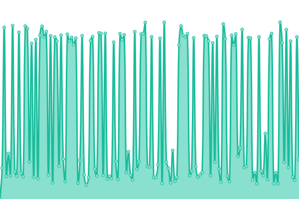 2491ms
     
 | 

<a href="https://PrjAdv.github.io/prjuptime/history/strill">69.73%</a>
    

|  [EMOZIONI FEED](https://emozionifeed.it/ads.txt) | 🟩 Up | [emozioni-feed.yml](https://github.com/PrjAdv/prjuptime/commits/HEAD/history/emozioni-feed.yml) | 

 1153ms
     
 | 

<a href="https://PrjAdv.github.io/prjuptime/history/emozioni-feed">100.00%</a>
    

|  [LO STADIUM](https://lostadium.it/ads.txt) | 🟩 Up | [lo-stadium.yml](https://github.com/PrjAdv/prjuptime/commits/HEAD/history/lo-stadium.yml) | 

 2143ms
     
 | 

<a href="https://PrjAdv.github.io/prjuptime/history/lo-stadium">100.00%</a>
    

|  [RIETILIFE](https://rietilife.com/ads.txt) | 🟩 Up | [rietilife.yml](https://github.com/PrjAdv/prjuptime/commits/HEAD/history/rietilife.yml) | 

 250ms
     
 | 

<a href="https://PrjAdv.github.io/prjuptime/history/rietilife">100.00%</a>
    

|  [TELE CLUB ITALIA](https://www.teleclubitalia.it/ads.txt) | 🟥 Down | [tele-club-italia.yml](https://github.com/PrjAdv/prjuptime/commits/HEAD/history/tele-club-italia.yml) | 

 173ms
     
 | 

<a href="https://PrjAdv.github.io/prjuptime/history/tele-club-italia">0.00%</a>
    

|  [HOW TO DO FOR](https://howtodofor.com/ads.txt) | 🟩 Up | [how-to-do-for.yml](https://github.com/PrjAdv/prjuptime/commits/HEAD/history/how-to-do-for.yml) | 

 870ms
     
 | 

<a href="https://PrjAdv.github.io/prjuptime/history/how-to-do-for">100.00%</a>
    

|  [GIUSEPPE PORRO](https://giuseppeporro.it/ads.txt) | 🟥 Down | [giuseppe-porro.yml](https://github.com/PrjAdv/prjuptime/commits/HEAD/history/giuseppe-porro.yml) | 

 796ms
     
 | 

<a href="https://PrjAdv.github.io/prjuptime/history/giuseppe-porro">0.00%</a>
    

|  [MONDO TV 24](https://mondotv24.it/ads.txt) | 🟥 Down | [mondo-tv-24.yml](https://github.com/PrjAdv/prjuptime/commits/HEAD/history/mondo-tv-24.yml) | 

 1388ms
     
 | 

<a href="https://PrjAdv.github.io/prjuptime/history/mondo-tv-24">0.00%</a>
    

|  [ZAZOOM](https://zazoom.it/ads.txt) | 🟥 Down | [zazoom.yml](https://github.com/PrjAdv/prjuptime/commits/HEAD/history/zazoom.yml) | 

 736ms
     
 | 

<a href="https://PrjAdv.github.io/prjuptime/history/zazoom">0.00%</a>
    

|  [RADIO ROSSO NERA](https://radiorossonera.it/ads.txt) | 🟩 Up | [radio-rosso-nera.yml](https://github.com/PrjAdv/prjuptime/commits/HEAD/history/radio-rosso-nera.yml) | 

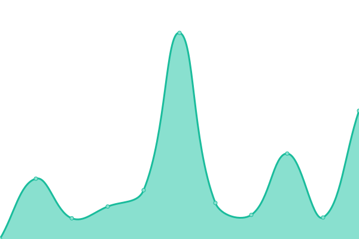 857ms
     
 | 

<a href="https://PrjAdv.github.io/prjuptime/history/radio-rosso-nera">91.04%</a>
    

|  [MILAN WORLD](https://milanworld.net/ads.txt) | 🟩 Up | [milan-world.yml](https://github.com/PrjAdv/prjuptime/commits/HEAD/history/milan-world.yml) | 

 1010ms
     
 | 

<a href="https://PrjAdv.github.io/prjuptime/history/milan-world">100.00%</a>
    

|  [TUTTO CALCIATORI](https://tuttocalciatori.net/ads.txt) | 🟩 Up | [tutto-calciatori.yml](https://github.com/PrjAdv/prjuptime/commits/HEAD/history/tutto-calciatori.yml) | 

 1119ms
     
 | 

<a href="https://PrjAdv.github.io/prjuptime/history/tutto-calciatori">100.00%</a>
    

|  [LIFELIVE](https://lifelive.eu/ads.txt) | 🟩 Up | [lifelive.yml](https://github.com/PrjAdv/prjuptime/commits/HEAD/history/lifelive.yml) | 

 661ms
     
 | 

<a href="https://PrjAdv.github.io/prjuptime/history/lifelive">100.00%</a>
    

|  [INTER-NEWS](https://inter-news.it/ads.txt) | 🟩 Up | [inter-news.yml](https://github.com/PrjAdv/prjuptime/commits/HEAD/history/inter-news.yml) | 

 775ms
     
 | 

<a href="https://PrjAdv.github.io/prjuptime/history/inter-news">98.94%</a>
    

|  [IL DISPACCIO](https://ildispaccio.it/ads.txt) | 🟩 Up | [il-dispaccio.yml](https://github.com/PrjAdv/prjuptime/commits/HEAD/history/il-dispaccio.yml) | 

 1332ms
     
 | 

<a href="https://PrjAdv.github.io/prjuptime/history/il-dispaccio">100.00%</a>
    

|  [VENETOGOL](https://venetogol.it/ads.txt) | 🟩 Up | [venetogol.yml](https://github.com/PrjAdv/prjuptime/commits/HEAD/history/venetogol.yml) | 

 1178ms
     
 | 

<a href="https://PrjAdv.github.io/prjuptime/history/venetogol">100.00%</a>
    

|  [FORZA AZZURRI](https://forzazzurri.net/ads.txt) | 🟩 Up | [forza-azzurri.yml](https://github.com/PrjAdv/prjuptime/commits/HEAD/history/forza-azzurri.yml) | 

 1009ms
     
 | 

<a href="https://PrjAdv.github.io/prjuptime/history/forza-azzurri">96.22%</a>
    

|  [E LO SAPEVI CHE](https://elosapeviche.com/ads.txt) | 🟩 Up | [e-lo-sapevi-che.yml](https://github.com/PrjAdv/prjuptime/commits/HEAD/history/e-lo-sapevi-che.yml) | 

 763ms
     
 | 

<a href="https://PrjAdv.github.io/prjuptime/history/e-lo-sapevi-che">100.00%</a>
    

|  [1 FEED](https://1feed.it/ads.txt) | 🟩 Up | [1-feed.yml](https://github.com/PrjAdv/prjuptime/commits/HEAD/history/1-feed.yml) | 

 1137ms
     
 | 

<a href="https://PrjAdv.github.io/prjuptime/history/1-feed">100.00%</a>
    

|  [WIKITESTI](https://wikitesti.com/ads.txt) | 🟩 Up | [wikitesti.yml](https://github.com/PrjAdv/prjuptime/commits/HEAD/history/wikitesti.yml) | 

 737ms
     
 | 

<a href="https://PrjAdv.github.io/prjuptime/history/wikitesti">100.00%</a>
    

|  [PASSIONECALCIO24](https://passionecalcio24.it/ads.txt) | 🟩 Up | [passionecalcio-24.yml](https://github.com/PrjAdv/prjuptime/commits/HEAD/history/passionecalcio-24.yml) | 

 1308ms
     
 | 

<a href="https://PrjAdv.github.io/prjuptime/history/passionecalcio-24">100.00%</a>
    

|  [LA PRESSA](https://lapressa.it/ads.txt) | 🟩 Up | [la-pressa.yml](https://github.com/PrjAdv/prjuptime/commits/HEAD/history/la-pressa.yml) | 

 1880ms
     
 | 

<a href="https://PrjAdv.github.io/prjuptime/history/la-pressa">100.00%</a>
    

|  [ECO DELLA LOCRIDE](https://ecodellalocride.it/ads.txt) | 🟩 Up | [eco-della-locride.yml](https://github.com/PrjAdv/prjuptime/commits/HEAD/history/eco-della-locride.yml) | 

 1771ms
     
 | 

<a href="https://PrjAdv.github.io/prjuptime/history/eco-della-locride">100.00%</a>
    

|  [IL GIARDINO DEGLI ILLUMINATI](https://ilgiardinodegliilluminati.it/ads.txt) | 🟩 Up | [il-giardino-degli-illuminati.yml](https://github.com/PrjAdv/prjuptime/commits/HEAD/history/il-giardino-degli-illuminati.yml) | 

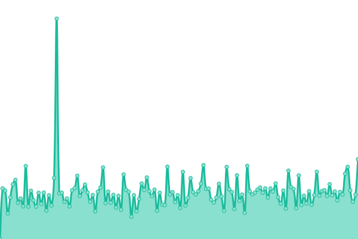 981ms
     
 | 

<a href="https://PrjAdv.github.io/prjuptime/history/il-giardino-degli-illuminati">92.61%</a>
    

|  [YOUTVRS](https://youtvrs.it/ads.txt) | 🟥 Down | [youtvrs.yml](https://github.com/PrjAdv/prjuptime/commits/HEAD/history/youtvrs.yml) | 

 1278ms
     
 | 

<a href="https://PrjAdv.github.io/prjuptime/history/youtvrs">0.00%</a>
    

|  [FRIULIGOL](https://www.friuligol.it/ads.txt) | 🟩 Up | [friuligol.yml](https://github.com/PrjAdv/prjuptime/commits/HEAD/history/friuligol.yml) | 

 322ms
     
 | 

<a href="https://PrjAdv.github.io/prjuptime/history/friuligol">96.22%</a>
    

|  [TORRESETTE](https://torresette.news/ads.txt) | 🟩 Up | [torresette.yml](https://github.com/PrjAdv/prjuptime/commits/HEAD/history/torresette.yml) | 

 1291ms
     
 | 

<a href="https://PrjAdv.github.io/prjuptime/history/torresette">100.00%</a>
    

|  [METEO PUGLIA](https://meteopuglia.org/ads.txt) | 🟩 Up | [meteo-puglia.yml](https://github.com/PrjAdv/prjuptime/commits/HEAD/history/meteo-puglia.yml) | 

 1787ms
     
 | 

<a href="https://PrjAdv.github.io/prjuptime/history/meteo-puglia">99.50%</a>
    

|  [GAZZETTA JONICA](https://gazzettajonica.it/ads.txt) | 🟩 Up | [gazzetta-jonica.yml](https://github.com/PrjAdv/prjuptime/commits/HEAD/history/gazzetta-jonica.yml) | 

 1970ms
     
 | 

<a href="https://PrjAdv.github.io/prjuptime/history/gazzetta-jonica">100.00%</a>
    

|  [LO STRILLONE NEWS](https://lostrillonenews.it/ads.txt) | 🟩 Up | [lo-strillone-news.yml](https://github.com/PrjAdv/prjuptime/commits/HEAD/history/lo-strillone-news.yml) | 

 1671ms
     
 | 

<a href="https://PrjAdv.github.io/prjuptime/history/lo-strillone-news">100.00%</a>
    

|  [XQUIZ](https://xquiz.it/ads.txt) | 🟩 Up | [xquiz.yml](https://github.com/PrjAdv/prjuptime/commits/HEAD/history/xquiz.yml) | 

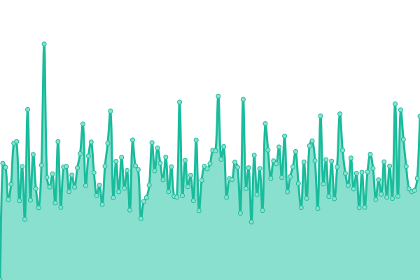 1033ms
     
 | 

<a href="https://PrjAdv.github.io/prjuptime/history/xquiz">92.66%</a>
    

|  [IL PRIMATO NAZIONALE](https://ilprimatonazionale.it/ads.txt) | 🟥 Down | [il-primato-nazionale.yml](https://github.com/PrjAdv/prjuptime/commits/HEAD/history/il-primato-nazionale.yml) | 

 1528ms
     
 | 

<a href="https://PrjAdv.github.io/prjuptime/history/il-primato-nazionale">0.00%</a>
    

|  [DOODLES](https://doodles.link/ads.txt) | 🟩 Up | [doodles.yml](https://github.com/PrjAdv/prjuptime/commits/HEAD/history/doodles.yml) | 

 739ms
     
 | 

<a href="https://PrjAdv.github.io/prjuptime/history/doodles">100.00%</a>
    

|  [MONTI PRENSTINI](https://montiprenestini.info/ads.txt) | 🟩 Up | [monti-prenstini.yml](https://github.com/PrjAdv/prjuptime/commits/HEAD/history/monti-prenstini.yml) | 

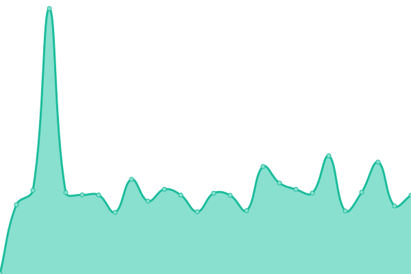 788ms
     
 | 

<a href="https://PrjAdv.github.io/prjuptime/history/monti-prenstini">91.04%</a>
    

|  [TERMOMETRO POLITICO](https://termometropolitico.it/ads.txt) | 🟥 Down | [termometro-politico.yml](https://github.com/PrjAdv/prjuptime/commits/HEAD/history/termometro-politico.yml) | 

 834ms
     
 | 

<a href="https://PrjAdv.github.io/prjuptime/history/termometro-politico">0.00%</a>
    

|  [TOSCANAGOL](https://toscanagol.it/ads.txt) | 🟩 Up | [toscanagol.yml](https://github.com/PrjAdv/prjuptime/commits/HEAD/history/toscanagol.yml) | 

 1107ms
     
 | 

<a href="https://PrjAdv.github.io/prjuptime/history/toscanagol">100.00%</a>
    

|  [TESTI TRADOTTI WIKITESTI](https://testitradotti.wikitesti.com/ads.txt) | 🟩 Up | [testi-tradotti-wikitesti.yml](https://github.com/PrjAdv/prjuptime/commits/HEAD/history/testi-tradotti-wikitesti.yml) | 

 2208ms
     
 | 

<a href="https://PrjAdv.github.io/prjuptime/history/testi-tradotti-wikitesti">100.00%</a>
    

|  [COME RISPARMIO SOLDI](https://comerisparmiosoldi.it/ads.txt) | 🟩 Up | [come-risparmio-soldi.yml](https://github.com/PrjAdv/prjuptime/commits/HEAD/history/come-risparmio-soldi.yml) | 

 1643ms
     
 | 

<a href="https://PrjAdv.github.io/prjuptime/history/come-risparmio-soldi">99.76%</a>
    

|  [H24 NOTIZIE](https://www.h24notizie.com/ads.txt) | 🟩 Up | [h24-notizie.yml](https://github.com/PrjAdv/prjuptime/commits/HEAD/history/h24-notizie.yml) | 

 1143ms
     
 | 

<a href="https://PrjAdv.github.io/prjuptime/history/h24-notizie">100.00%</a>
    

|  [NAPOLITAN](https://napolitan.it/ads.txt) | 🟩 Up | [napolitan.yml](https://github.com/PrjAdv/prjuptime/commits/HEAD/history/napolitan.yml) | 

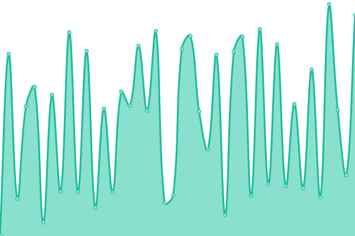 526ms
     
 | 

<a href="https://PrjAdv.github.io/prjuptime/history/napolitan">97.31%</a>
    

|  [LETTERA EMME](https://letteraemme.it/ads.txt) | 🟥 Down | [lettera-emme.yml](https://github.com/PrjAdv/prjuptime/commits/HEAD/history/lettera-emme.yml) | 

 3033ms
     
 | 

<a href="https://PrjAdv.github.io/prjuptime/history/lettera-emme">0.00%</a>
    

|  [GOLDWEBTV](https://www.goldwebtv.it/ads.txt) | 🟩 Up | [goldwebtv.yml](https://github.com/PrjAdv/prjuptime/commits/HEAD/history/goldwebtv.yml) | 

 1587ms
     
 | 

<a href="https://PrjAdv.github.io/prjuptime/history/goldwebtv">99.29%</a>
    

|  [TELEMIA](https://www.telemia.it/ads.txt) | 🟩 Up | [telemia.yml](https://github.com/PrjAdv/prjuptime/commits/HEAD/history/telemia.yml) | 

 1200ms
     
 | 

<a href="https://PrjAdv.github.io/prjuptime/history/telemia">98.59%</a>
    

|  [GIOCOINDIE](https://giocoindie.it/ads.txt) | 🟥 Down | [giocoindie.yml](https://github.com/PrjAdv/prjuptime/commits/HEAD/history/giocoindie.yml) | 

 1113ms
     
 | 

<a href="https://PrjAdv.github.io/prjuptime/history/giocoindie">0.00%</a>
    

|  [MILAN NIGHT](https://milannight.com/ads.txt) | 🟩 Up | [milan-night.yml](https://github.com/PrjAdv/prjuptime/commits/HEAD/history/milan-night.yml) | 

 1010ms
     
 | 

<a href="https://PrjAdv.github.io/prjuptime/history/milan-night">100.00%</a>
    

|  [B 1897](https://b1897.it/ads.txt) | 🟥 Down | [b-1897.yml](https://github.com/PrjAdv/prjuptime/commits/HEAD/history/b-1897.yml) | 

 819ms
     
 | 

<a href="https://PrjAdv.github.io/prjuptime/history/b-1897">0.00%</a>
    

|  [IL GIORNALE DI TRANI](https://ilgiornaleditrani.it/ads.txt) | 🟥 Down | [il-giornale-di-trani.yml](https://github.com/PrjAdv/prjuptime/commits/HEAD/history/il-giornale-di-trani.yml) | 

 1468ms
     
 | 

<a href="https://PrjAdv.github.io/prjuptime/history/il-giornale-di-trani">0.00%</a>
    

|  [NUOVO SUD](https://nuovosud.it/ads.txt) | 🟥 Down | [nuovo-sud.yml](https://github.com/PrjAdv/prjuptime/commits/HEAD/history/nuovo-sud.yml) | 

 1709ms
     
 | 

<a href="https://PrjAdv.github.io/prjuptime/history/nuovo-sud">0.00%</a>
    

|  [RASSEGNE ITALIA](https://rassegneitalia.info/ads.txt) | 🟥 Down | [rassegne-italia.yml](https://github.com/PrjAdv/prjuptime/commits/HEAD/history/rassegne-italia.yml) | 

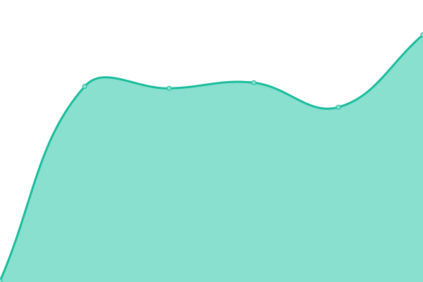 227ms
     
 | 

<a href="https://PrjAdv.github.io/prjuptime/history/rassegne-italia">0.00%</a>
    

|  [SARDEGNA REPORTER](https://sardegnareporter.it/ads.txt) | 🟩 Up | [sardegna-reporter.yml](https://github.com/PrjAdv/prjuptime/commits/HEAD/history/sardegna-reporter.yml) | 

 757ms
     
 | 

<a href="https://PrjAdv.github.io/prjuptime/history/sardegna-reporter">93.86%</a>
    

|  [STYLO24](https://stylo24.it/ads.txt) | 🟥 Down | [stylo-24.yml](https://github.com/PrjAdv/prjuptime/commits/HEAD/history/stylo-24.yml) | 

 1729ms
     
 | 

<a href="https://PrjAdv.github.io/prjuptime/history/stylo-24">0.00%</a>
    

|  [MESSINA SPORTIVA](https://messinasportiva.it/ads.txt) | 🟩 Up | [messina-sportiva.yml](https://github.com/PrjAdv/prjuptime/commits/HEAD/history/messina-sportiva.yml) | 

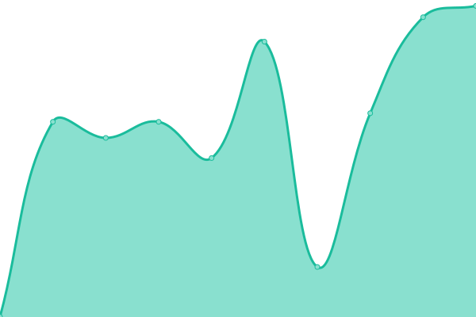 1584ms
     
 | 

<a href="https://PrjAdv.github.io/prjuptime/history/messina-sportiva">100.00%</a>
    

|  [EMILIAGOL](https://emiliagol.it/ads.txt) | 🟩 Up | [emiliagol.yml](https://github.com/PrjAdv/prjuptime/commits/HEAD/history/emiliagol.yml) | 

 1102ms
     
 | 

<a href="https://PrjAdv.github.io/prjuptime/history/emiliagol">100.00%</a>
    

|  [VERY INUTIL PEOPLE](https://www.veryinutilpeople.it/ads.txt) | 🟩 Up | [very-inutil-people.yml](https://github.com/PrjAdv/prjuptime/commits/HEAD/history/very-inutil-people.yml) | 

 932ms
     
 | 

<a href="https://PrjAdv.github.io/prjuptime/history/very-inutil-people">100.00%</a>
    

|  [IL NAPOLI ON LINE](https://www.ilnapolionline.com/ads.txt) | 🟩 Up | [il-napoli-on-line.yml](https://github.com/PrjAdv/prjuptime/commits/HEAD/history/il-napoli-on-line.yml) | 

 623ms
     
 | 

<a href="https://PrjAdv.github.io/prjuptime/history/il-napoli-on-line">100.00%</a>
    

|  [INFORMA-PRESS](https://informa-press.it/ads.txt) | 🟩 Up | [informa-press.yml](https://github.com/PrjAdv/prjuptime/commits/HEAD/history/informa-press.yml) | 

 854ms
     
 | 

<a href="https://PrjAdv.github.io/prjuptime/history/informa-press">100.00%</a>
    

|  [GROSSETOSPORT](https://grossetosport.com/ads.txt) | 🟥 Down | [grossetosport.yml](https://github.com/PrjAdv/prjuptime/commits/HEAD/history/grossetosport.yml) | 

 906ms
     
 | 

<a href="https://PrjAdv.github.io/prjuptime/history/grossetosport">0.00%</a>
    

|  [PROVE INVALSI](https://proveinvalsi.net/ads.txt) | 🟩 Up | [prove-invalsi.yml](https://github.com/PrjAdv/prjuptime/commits/HEAD/history/prove-invalsi.yml) | 

 1729ms
     
 | 

<a href="https://PrjAdv.github.io/prjuptime/history/prove-invalsi">100.00%</a>
    

|  [TOSCANA OGGI](https://toscanaoggi.it/ads.txt) | 🟩 Up | [toscana-oggi.yml](https://github.com/PrjAdv/prjuptime/commits/HEAD/history/toscana-oggi.yml) | 

 989ms
     
 | 

<a href="https://PrjAdv.github.io/prjuptime/history/toscana-oggi">100.00%</a>
    

|  [TRA GENIO E FOLLIA](https://tragenioefollia.com/ads.txt) | 🟥 Down | [tra-genio-e-follia.yml](https://github.com/PrjAdv/prjuptime/commits/HEAD/history/tra-genio-e-follia.yml) | 

 0ms
     
 | 

<a href="https://PrjAdv.github.io/prjuptime/history/tra-genio-e-follia">0.00%</a>
    

|  [NORD MILANO 24](https://nordmilano24.it/ads.txt) | 🟩 Up | [nord-milano-24.yml](https://github.com/PrjAdv/prjuptime/commits/HEAD/history/nord-milano-24.yml) | 

 1141ms
     
 | 

<a href="https://PrjAdv.github.io/prjuptime/history/nord-milano-24">100.00%</a>
    

|  [BONCULTURE](https://bonculture.it/ads.txt) | 🟩 Up | [bonculture.yml](https://github.com/PrjAdv/prjuptime/commits/HEAD/history/bonculture.yml) | 

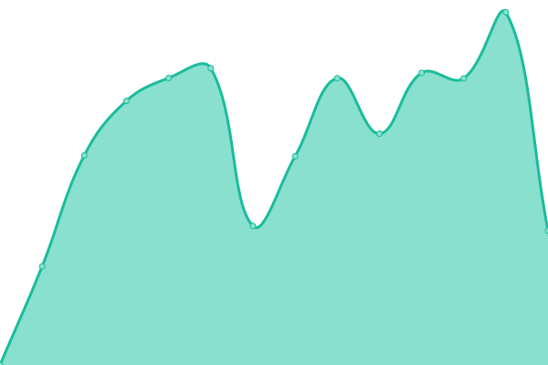 2196ms
     
 | 

<a href="https://PrjAdv.github.io/prjuptime/history/bonculture">99.61%</a>
    

|  [TUTTO REGGIANA](https://tuttoreggiana.com/ads.txt) | 🟩 Up | [tutto-reggiana.yml](https://github.com/PrjAdv/prjuptime/commits/HEAD/history/tutto-reggiana.yml) | 

 1000ms
     
 | 

<a href="https://PrjAdv.github.io/prjuptime/history/tutto-reggiana">96.83%</a>
    

|  [LAZIO NASCOSTO](https://lazionascosto.it/ads.txt) | 🟩 Up | [lazio-nascosto.yml](https://github.com/PrjAdv/prjuptime/commits/HEAD/history/lazio-nascosto.yml) | 

 1288ms
     
 | 

<a href="https://PrjAdv.github.io/prjuptime/history/lazio-nascosto">100.00%</a>
    

|  [SENIGALLIA NOTIZIE](https://senigallianotizie.it/ads.txt) | 🟩 Up | [senigallia-notizie.yml](https://github.com/PrjAdv/prjuptime/commits/HEAD/history/senigallia-notizie.yml) | 

 2123ms
     
 | 

<a href="https://PrjAdv.github.io/prjuptime/history/senigallia-notizie">100.00%</a>
    

|  [FASHION TIMES](https://fashiontimes.it/ads.txt) | 🟩 Up | [fashion-times.yml](https://github.com/PrjAdv/prjuptime/commits/HEAD/history/fashion-times.yml) | 

 942ms
     
 | 

<a href="https://PrjAdv.github.io/prjuptime/history/fashion-times">100.00%</a>
    

|  [ERRE EMME NEWS](https://erreemmenews.it/ads.txt) | 🟩 Up | [erre-emme-news.yml](https://github.com/PrjAdv/prjuptime/commits/HEAD/history/erre-emme-news.yml) | 

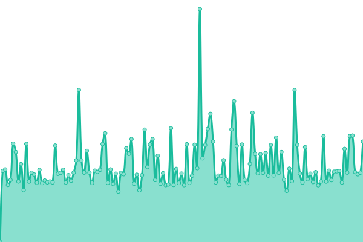 867ms
     
 | 

<a href="https://PrjAdv.github.io/prjuptime/history/erre-emme-news">92.68%</a>
    

|  [VIAGGIAMO](https://viaggiamo.it/ads.txt) | 🟩 Up | [viaggiamo.yml](https://github.com/PrjAdv/prjuptime/commits/HEAD/history/viaggiamo.yml) | 

 1352ms
     
 | 

<a href="https://PrjAdv.github.io/prjuptime/history/viaggiamo">99.83%</a>
    

|  [LA NOTIZIA SPORTIVA](https://lanotiziasportiva.com/ads.txt) | 🟥 Down | [la-notizia-sportiva.yml](https://github.com/PrjAdv/prjuptime/commits/HEAD/history/la-notizia-sportiva.yml) | 

 1502ms
     
 | 

<a href="https://PrjAdv.github.io/prjuptime/history/la-notizia-sportiva">0.00%</a>
    

|  [STADIO RADIO](https://stadioradio.it/ads.txt) | 🟩 Up | [stadio-radio.yml](https://github.com/PrjAdv/prjuptime/commits/HEAD/history/stadio-radio.yml) | 

 965ms
     
 | 

<a href="https://PrjAdv.github.io/prjuptime/history/stadio-radio">100.00%</a>
    

|  [GAZZETTA DELLA SPEZIA](https://gazzettadellaspezia.com/ads.txt) | 🟩 Up | [gazzetta-della-spezia.yml](https://github.com/PrjAdv/prjuptime/commits/HEAD/history/gazzetta-della-spezia.yml) | 

 1065ms
     
 | 

<a href="https://PrjAdv.github.io/prjuptime/history/gazzetta-della-spezia">100.00%</a>
    

|  [LO STATALE JONICO](https://lostatalejonico.it/ads.txt) | 🟩 Up | [lo-statale-jonico.yml](https://github.com/PrjAdv/prjuptime/commits/HEAD/history/lo-statale-jonico.yml) | 

 3025ms
     
 | 

<a href="https://PrjAdv.github.io/prjuptime/history/lo-statale-jonico">100.00%</a>
    

|  [LA TORRE 1905](https://latorre1905.it/ads.txt) | 🟩 Up | [la-torre-1905.yml](https://github.com/PrjAdv/prjuptime/commits/HEAD/history/la-torre-1905.yml) | 

 1082ms
     
 | 

<a href="https://PrjAdv.github.io/prjuptime/history/la-torre-1905">100.00%</a>
    

|  [SIKILY NEWS](https://sikilynews.it/ads.txt) | 🟩 Up | [sikily-news.yml](https://github.com/PrjAdv/prjuptime/commits/HEAD/history/sikily-news.yml) | 

 1092ms
     
 | 

<a href="https://PrjAdv.github.io/prjuptime/history/sikily-news">100.00%</a>
    

|  [FUT18 ITALIA](https://fut18italia.it/ads.txt) | 🟩 Up | [fut-18-italia.yml](https://github.com/PrjAdv/prjuptime/commits/HEAD/history/fut-18-italia.yml) | 

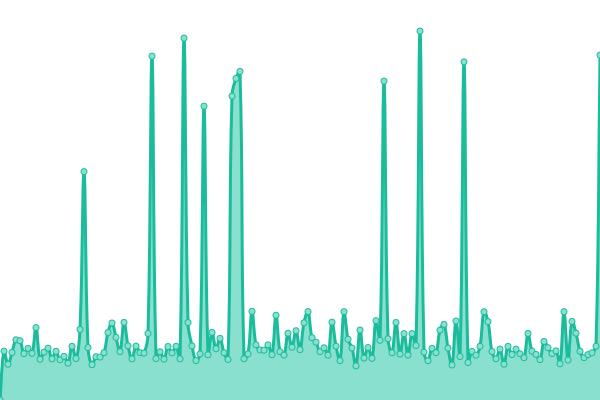 1146ms
     
 | 

<a href="https://PrjAdv.github.io/prjuptime/history/fut-18-italia">92.86%</a>
    

|  [SICILIANS](https://sicilians.it/ads.txt) | 🟩 Up | [sicilians.yml](https://github.com/PrjAdv/prjuptime/commits/HEAD/history/sicilians.yml) | 

 1679ms
     
 | 

<a href="https://PrjAdv.github.io/prjuptime/history/sicilians">100.00%</a>
    

|  [vastoweb](https://vastoweb.com/ads.txt) | 🟥 Down | [vastoweb.yml](https://github.com/PrjAdv/prjuptime/commits/HEAD/history/vastoweb.yml) | 

 804ms
     
 | 

<a href="https://PrjAdv.github.io/prjuptime/history/vastoweb">0.00%</a>
    

|  [termolionline](https://termolionline.it/ads.txt) | 🟥 Down | [termolionline.yml](https://github.com/PrjAdv/prjuptime/commits/HEAD/history/termolionline.yml) | 

 828ms
     
 | 

<a href="https://PrjAdv.github.io/prjuptime/history/termolionline">0.00%</a>
    

|  [TERNILIFE](https://www.ternilife.com/ads.txt) | 🟩 Up | [ternilife.yml](https://github.com/PrjAdv/prjuptime/commits/HEAD/history/ternilife.yml) | 

 227ms
     
 | 

<a href="https://PrjAdv.github.io/prjuptime/history/ternilife">100.00%</a>
    

|  [SPORTDELSUD](https://sportdelsud.it/ads.txt) | 🟥 Down | [sportdelsud.yml](https://github.com/PrjAdv/prjuptime/commits/HEAD/history/sportdelsud.yml) | 

 965ms
     
 | 

<a href="https://PrjAdv.github.io/prjuptime/history/sportdelsud">0.00%</a>
    

|  [ITALIALIFE24](https://italialife24.it/ads.txt) | 🟩 Up | [italialife-24.yml](https://github.com/PrjAdv/prjuptime/commits/HEAD/history/italialife-24.yml) | 

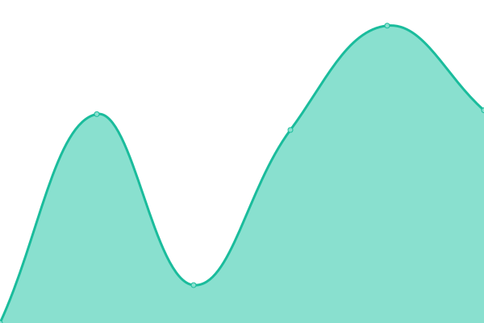 975ms
     
 | 

<a href="https://PrjAdv.github.io/prjuptime/history/italialife-24">92.87%</a>
    

|  [ITAGNOL](https://itagnol.com/ads.txt) | 🟥 Down | [itagnol.yml](https://github.com/PrjAdv/prjuptime/commits/HEAD/history/itagnol.yml) | 

 1026ms
     
 | 

<a href="https://PrjAdv.github.io/prjuptime/history/itagnol">0.00%</a>
    

|  [LA MILANO](https://lamilano.it/ads.txt) | 🟥 Down | [la-milano.yml](https://github.com/PrjAdv/prjuptime/commits/HEAD/history/la-milano.yml) | 

 983ms
     
 | 

<a href="https://PrjAdv.github.io/prjuptime/history/la-milano">0.00%</a>
    

|  [MILANO DA VEDERE](https://milanodavedere.it/ads.txt) | 🟩 Up | [milano-da-vedere.yml](https://github.com/PrjAdv/prjuptime/commits/HEAD/history/milano-da-vedere.yml) | 

 1099ms
     
 | 

<a href="https://PrjAdv.github.io/prjuptime/history/milano-da-vedere">100.00%</a>
    

|  [SENZA LINEA](https://senzalinea.it/ads.txt) | 🟥 Down | [senza-linea.yml](https://github.com/PrjAdv/prjuptime/commits/HEAD/history/senza-linea.yml) | 

 1485ms
     
 | 

<a href="https://PrjAdv.github.io/prjuptime/history/senza-linea">0.00%</a>
    

|  [ZERKALO SPETTACOLO](https://zerkalospettacolo.com/ads.txt) | 🟩 Up | [zerkalo-spettacolo.yml](https://github.com/PrjAdv/prjuptime/commits/HEAD/history/zerkalo-spettacolo.yml) | 

 2209ms
     
 | 

<a href="https://PrjAdv.github.io/prjuptime/history/zerkalo-spettacolo">99.24%</a>
    

|  [ROMA FOREVER](https://www.romaforever.it/ads.txt) | 🟥 Down | [roma-forever.yml](https://github.com/PrjAdv/prjuptime/commits/HEAD/history/roma-forever.yml) | 

 1109ms
     
 | 

<a href="https://PrjAdv.github.io/prjuptime/history/roma-forever">0.00%</a>
    

|  [CASA MAGAZINE](https://casamagazine.it/ads.txt) | 🟩 Up | [casa-magazine.yml](https://github.com/PrjAdv/prjuptime/commits/HEAD/history/casa-magazine.yml) | 

 1276ms
     
 | 

<a href="https://PrjAdv.github.io/prjuptime/history/casa-magazine">99.84%</a>
    

|  [SETTE NEWS](https://settenews.it/ads.txt) | 🟩 Up | [sette-news.yml](https://github.com/PrjAdv/prjuptime/commits/HEAD/history/sette-news.yml) | 

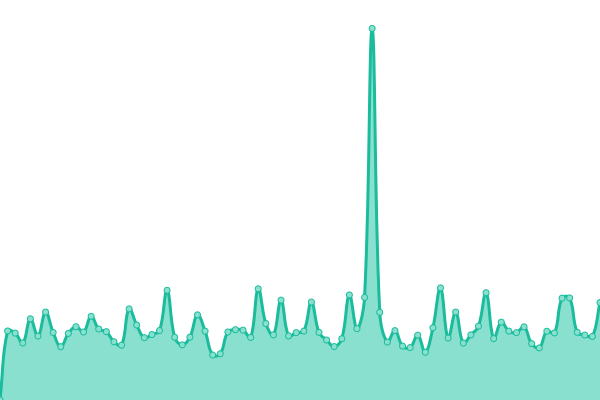 897ms
     
 | 

<a href="https://PrjAdv.github.io/prjuptime/history/sette-news">92.76%</a>
    

|  [SPORT MAGAZINE](https://sportmagazine.it/ads.txt) | 🟩 Up | [sport-magazine.yml](https://github.com/PrjAdv/prjuptime/commits/HEAD/history/sport-magazine.yml) | 

 1134ms
     
 | 

<a href="https://PrjAdv.github.io/prjuptime/history/sport-magazine">100.00%</a>
    

|  [TECNOGLAXY](https://tecnogalaxy.it/ads.txt) | 🟥 Down | [tecnoglaxy.yml](https://github.com/PrjAdv/prjuptime/commits/HEAD/history/tecnoglaxy.yml) | 

 217ms
     
 | 

<a href="https://PrjAdv.github.io/prjuptime/history/tecnoglaxy">0.00%</a>
    

|  [IL FARO ONLINE](https://ilfaroonline.it/ads.txt) | 🟥 Down | [il-faro-online.yml](https://github.com/PrjAdv/prjuptime/commits/HEAD/history/il-faro-online.yml) | 

 2255ms
     
 | 

<a href="https://PrjAdv.github.io/prjuptime/history/il-faro-online">0.00%</a>
    

|  [MAMME MAGAZINE](https://mammemagazine.it/ads.txt) | 🟥 Down | [mamme-magazine.yml](https://github.com/PrjAdv/prjuptime/commits/HEAD/history/mamme-magazine.yml) | 

 10690ms
     
 | 

<a href="https://PrjAdv.github.io/prjuptime/history/mamme-magazine">0.00%</a>
    

|  [GENIUS WELLNESS](https://geniuswellness.net/ads.txt) | 🟥 Down | [genius-wellness.yml](https://github.com/PrjAdv/prjuptime/commits/HEAD/history/genius-wellness.yml) | 

 229ms
     
 | 

<a href="https://PrjAdv.github.io/prjuptime/history/genius-wellness">0.00%</a>
    

|  [IL COINQUILINO DI EMME](https://ilcoinquilinodiemme.it/ads.txt) | 🟩 Up | [il-coinquilino-di-emme.yml](https://github.com/PrjAdv/prjuptime/commits/HEAD/history/il-coinquilino-di-emme.yml) | 

 1652ms
     
 | 

<a href="https://PrjAdv.github.io/prjuptime/history/il-coinquilino-di-emme">100.00%</a>
    

|  [BLOG SOCIAL TV](https://blogsocialtv.com/ads.txt) | 🟩 Up | [blog-social-tv.yml](https://github.com/PrjAdv/prjuptime/commits/HEAD/history/blog-social-tv.yml) | 

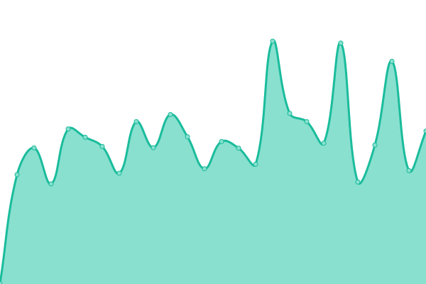 701ms
     
 | 

<a href="https://PrjAdv.github.io/prjuptime/history/blog-social-tv">91.04%</a>
    

|  [FUORI TRAIETTORIA](https://fuoritraiettoria.com/ads.txt) | 🟩 Up | [fuori-traiettoria.yml](https://github.com/PrjAdv/prjuptime/commits/HEAD/history/fuori-traiettoria.yml) | 

 2521ms
     
 | 

<a href="https://PrjAdv.github.io/prjuptime/history/fuori-traiettoria">100.00%</a>
    

|  [casa napoli](https://casanapoli.net/ads.txt) | 🟩 Up | [casa-napoli.yml](https://github.com/PrjAdv/prjuptime/commits/HEAD/history/casa-napoli.yml) | 

 1534ms
     
 | 

<a href="https://PrjAdv.github.io/prjuptime/history/casa-napoli">100.00%</a>
    

|  [NEWGO](https://newsgo.it/ads.txt) | 🟥 Down | [newgo.yml](https://github.com/PrjAdv/prjuptime/commits/HEAD/history/newgo.yml) | 

 714ms
     
 | 

<a href="https://PrjAdv.github.io/prjuptime/history/newgo">0.00%</a>
    

|  [ICONA METEO](https://www.iconameteo.it/ads.txt) | 🟩 Up | [icona-meteo.yml](https://github.com/PrjAdv/prjuptime/commits/HEAD/history/icona-meteo.yml) | 

 1530ms
     
 | 

<a href="https://PrjAdv.github.io/prjuptime/history/icona-meteo">100.00%</a>
    

|  [MARCHE IN GOL](https://marcheingol.it/ads.txt) | 🟥 Down | [marche-in-gol.yml](https://github.com/PrjAdv/prjuptime/commits/HEAD/history/marche-in-gol.yml) | 

 2706ms
     
 | 

<a href="https://PrjAdv.github.io/prjuptime/history/marche-in-gol">0.00%</a>
    

|  [ICONA CLIMA](https://www.iconaclima.it/ads.txt) | 🟩 Up | [icona-clima.yml](https://github.com/PrjAdv/prjuptime/commits/HEAD/history/icona-clima.yml) | 

 1201ms
     
 | 

<a href="https://PrjAdv.github.io/prjuptime/history/icona-clima">100.00%</a>
    

|  [VOCE.COM.VE](https://lavoceditalia.com/ads.txt) | 🟩 Up | [voce-com-ve.yml](https://github.com/PrjAdv/prjuptime/commits/HEAD/history/voce-com-ve.yml) | 

 579ms
     
 | 

<a href="https://PrjAdv.github.io/prjuptime/history/voce-com-ve">100.00%</a>
    

|  [TUTTO SPAL](https://www.tuttospal.it/ads.txt) | 🟩 Up | [tutto-spal.yml](https://github.com/PrjAdv/prjuptime/commits/HEAD/history/tutto-spal.yml) | 

 1287ms
     
 | 

<a href="https://PrjAdv.github.io/prjuptime/history/tutto-spal">100.00%</a>
    

|  [VALLE DEI SOGNI](https://valledeisogni.it/ads.txt) | 🟥 Down | [valle-dei-sogni.yml](https://github.com/PrjAdv/prjuptime/commits/HEAD/history/valle-dei-sogni.yml) | 

 737ms
     
 | 

<a href="https://PrjAdv.github.io/prjuptime/history/valle-dei-sogni">0.00%</a>
    

|  [MAREONLINE](https://www.mareonline.it/ads.txt) | 🟩 Up | [mareonline.yml](https://github.com/PrjAdv/prjuptime/commits/HEAD/history/mareonline.yml) | 

 1233ms
     
 | 

<a href="https://PrjAdv.github.io/prjuptime/history/mareonline">100.00%</a>
    

|  [ECODELCINEMA](https://ecodelcinema.com/ads.txt) | 🟥 Down | [ecodelcinema.yml](https://github.com/PrjAdv/prjuptime/commits/HEAD/history/ecodelcinema.yml) | 

 1585ms
     
 | 

<a href="https://PrjAdv.github.io/prjuptime/history/ecodelcinema">0.00%</a>
    

|  [INTERPRETA SOGNO](https://interpretasogno.com/ads.txt) | 🟥 Down | [interpreta-sogno.yml](https://github.com/PrjAdv/prjuptime/commits/HEAD/history/interpreta-sogno.yml) | 

 0ms
     
 | 

<a href="https://PrjAdv.github.io/prjuptime/history/interpreta-sogno">0.00%</a>
    

|  [TUTTO MANTOVA](https://www.tuttomantova.it/ads.txt) | 🟩 Up | [tutto-mantova.yml](https://github.com/PrjAdv/prjuptime/commits/HEAD/history/tutto-mantova.yml) | 

 1200ms
     
 | 

<a href="https://PrjAdv.github.io/prjuptime/history/tutto-mantova">100.00%</a>
    

|  [GENIUS HOROSCOPE](https://geniushoroscope.com/ads.txt) | 🟥 Down | [genius-horoscope.yml](https://github.com/PrjAdv/prjuptime/commits/HEAD/history/genius-horoscope.yml) | 

 0ms
     
 | 

<a href="https://PrjAdv.github.io/prjuptime/history/genius-horoscope">0.00%</a>
    

|  [NOVECENTO LETTERARIO](https://900letterario.it/ads.txt) | 🟥 Down | [novecento-letterario.yml](https://github.com/PrjAdv/prjuptime/commits/HEAD/history/novecento-letterario.yml) | 

 1400ms
     
 | 

<a href="https://PrjAdv.github.io/prjuptime/history/novecento-letterario">0.00%</a>
    

|  [CAMBIO CLIMA](https://cambioclima.it/ads.txt) | 🟥 Down | [cambio-clima.yml](https://github.com/PrjAdv/prjuptime/commits/HEAD/history/cambio-clima.yml) | 

 2012ms
     
 | 

<a href="https://PrjAdv.github.io/prjuptime/history/cambio-clima">0.00%</a>
    

|  [SYRUS](https://syrus.academy/ads.txt) | 🟥 Down | [syrus.yml](https://github.com/PrjAdv/prjuptime/commits/HEAD/history/syrus.yml) | 

 473ms
     
 | 

<a href="https://PrjAdv.github.io/prjuptime/history/syrus">0.00%</a>
    

|  [BAZZING](https://bazzing.it/ads.txt) | 🟩 Up | [bazzing.yml](https://github.com/PrjAdv/prjuptime/commits/HEAD/history/bazzing.yml) | 

 1137ms
     
 | 

<a href="https://PrjAdv.github.io/prjuptime/history/bazzing">99.73%</a>
    

|  [METEO CONENNA](https://meteoconenna.it/ads.txt) | 🟩 Up | [meteo-conenna.yml](https://github.com/PrjAdv/prjuptime/commits/HEAD/history/meteo-conenna.yml) | 

 1620ms
     
 | 

<a href="https://PrjAdv.github.io/prjuptime/history/meteo-conenna">100.00%</a>
    

|  [MAFREGATE](https://mafregate.it/ads.txt) | 🟥 Down | [mafregate.yml](https://github.com/PrjAdv/prjuptime/commits/HEAD/history/mafregate.yml) | 

 0ms
     
 | 

<a href="https://PrjAdv.github.io/prjuptime/history/mafregate">0.00%</a>
    

|  [ACCADEORA](https://accadeora.it/ads.txt) | 🟥 Down | [accadeora.yml](https://github.com/PrjAdv/prjuptime/commits/HEAD/history/accadeora.yml) | 

 2849ms
     
 | 

<a href="https://PrjAdv.github.io/prjuptime/history/accadeora">0.00%</a>
    

|  [LA NOTIZIA - ADS.TXT](https://www.la-notizia.net/ads.txt) | 🟥 Down | [la-notizia-ads-txt.yml](https://github.com/PrjAdv/prjuptime/commits/HEAD/history/la-notizia-ads-txt.yml) | 

 653ms
     
 | 

<a href="https://PrjAdv.github.io/prjuptime/history/la-notizia-ads-txt">0.00%</a>
    

<!--end: status pages-->

[**Visit our status website →**](https://demo.upptime.js.org)

## 📄 License

- Powered by: [Upptime](https://github.com/upptime/upptime)
- Code: [MIT](./LICENSE) © [Upptime](https://upptime.js.org)
- Data in the `./history` directory: [Open Database License](https://opendatacommons.org/licenses/odbl/1-0/)
